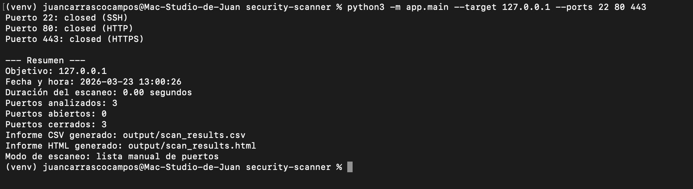
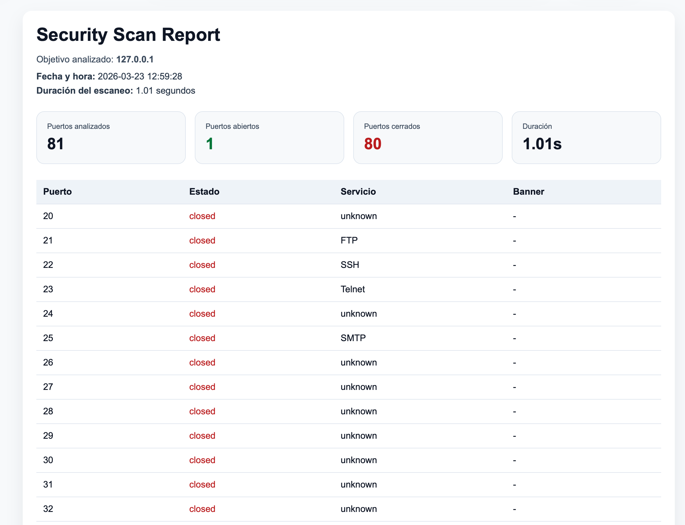

# Security Scanner CLI

Python CLI tool for basic network port scanning, banner grabbing, and CSV/HTML security reporting.

## Quick Start

```bash
python3 -m venv venv
source venv/bin/activate
python3 -m app.main --target 127.0.0.1 --range 20 100 --output-name scan_cards
```

## Preview






## Features

- TCP port scanning
- Common ports scan by default
- Manual port list scanning
- Port range scanning
- Open/closed status detection
- Common service mapping
- Basic banner grabbing
- CSV report generation
- HTML visual report
- Summary cards in HTML
- Timestamp and scan duration
- CLI usage

## Tech Stack

- Python
- Socket
- Argparse
- CSV
- HTML
- Pathlib

## Project Structure

```bash
security-scanner/
│
├── app/
│   ├── main.py
│   ├── scanner.py
│   └── exporter.py
│
├── assets/
├── requirements.txt
└── README.md
```

## Installation

```bash
git clone <TU_REPO_URL>
cd security-scanner
python3 -m venv venv
source venv/bin/activate
```

## Usage

### Default ports

```bash
python3 -m app.main --target 127.0.0.1
```

### Manual ports

```bash
python3 -m app.main --target 127.0.0.1 --ports 22 80 443
```

### Port range

```bash
python3 -m app.main --target 127.0.0.1 --range 20 100
```

### Custom output name

```bash
python3 -m app.main --target 127.0.0.1 --range 20 100 --output-name scan_local
```

### Timeout adjustment

```bash
python3 -m app.main --target 127.0.0.1 --range 1 1024 --timeout 0.5
```

## Example Output

Generated files:
- `output/scan_local.csv`
- `output/scan_local.html`

Reported fields:
- `target`
- `port`
- `status`
- `service`
- `banner`

## Use Cases

- Authorized internal audits
- Local lab testing
- Service inventory
- Basic network checks
- Cybersecurity training environments
- Technical reporting workflows

## Important Notice

This project is intended only for:
- systems you own
- lab environments
- explicitly authorized targets

It must not be used against third-party systems without permission.

## Future Improvements

- Hostname and IP resolution in reports
- Multi-threaded scanning
- JSON export
- Advanced banner detection
- Web interface
- Database storage
- Risk scoring by service

## Author

Developed by Juan Carrasco as part of a freelance-oriented portfolio focused on Python, automation, and basic cybersecurity tooling.
